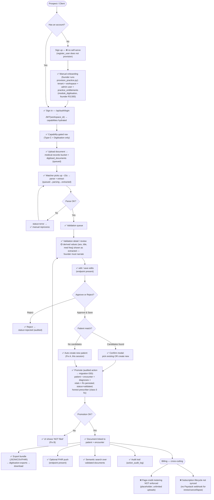

# Digitisation Workflow — End-to-End Coverage Matrix

> Audited 2026-05-19 against the live codebase (DEV). Status legend:
> **✅ Covered** = verified working (most end-to-end this session);
> **🟡 Partial** = works but with a caveat/limit;
> **❌ Gap** = missing, needs build. file:line = where it lives.

---

## 0. End-to-end workflow map

Status encoded in every node: **✅** covered · **🟡** partial/caveat · **❌** gap.



ASCII fallback (same flow, for viewers without Mermaid):

```
Prospect / Client
   |
   +-- has account? --NO--> Sign up [❌ no self-serve]
   |                          -> ✅ Manual onboarding (provision_practice.py:
   |                             tenant+workspace+admin+entitlement, founder R3,500)
   +-- has account? --YES---------------------------------+
                                                          v
                                   ✅ Sign in (JWT + capabilities)
                                                          |
                                   ✅ Capability-gated nav (Type-C: Digitisation)
                                                          |
                                   ✅ Upload (medical-records + queued row)
                                                          |
                                   ✅ Watcher: parse+extract  --fail--> error -> reprocess (loop)
                                                          | ok
                                   ✅ Validation queue
                                                          |
                                   ✅ Validation detail/review  [🟡 derived shown as extracted]
                                                          |
                                   ✅ edit/save  -->  Approve OR Reject
                                                          |                 \
                                            Approve & Save                   ✅ Reject -> rejected
                                                          |
                              patient match? --candidates--> ✅ confirm modal (pick / new)
                                              --none-------> ✅ auto create-new (Fix A)
                                                          |
                              ✅ Promote (audited -> migration 030):
                                 patient+encounter+dx+vitals+Rx, status=validated,
                                 honest prescriber
                                                          |
                              promotion ok? --no--> ✅ "NOT filed" (Fix B) -> back to review
                                            --yes-> ✅ doc linked to patient/encounter
                                                          |
                          +----------------+-------------------+----------------+
                          v                v                   v                v
                 ✅ Export bundle   ✅ FHIR push      ✅ Semantic search   ✅ Audit trail
                 (JSON/CSV/FHIR)    (optional)        (validated docs)    (action_audit_log)

   Cross-cutting BILLING:  ❌ page-credit metering NOT enforced
                           ❌ subscription lifecycle not synced (no Paystack webhook)
```

The two ❌ billing nodes are the only things in the path that aren't
covered for a *scaled* paying customer; everything on the document
journey itself is ✅ (verified live this session) or 🟡 (the
founder-narrate caveat). Detail per step in the matrix below.

---

## A. Sign-up / account creation

| Step | Expected | Where | Status | Gap / what's needed |
|---|---|---|---|---|
| Client self-serve sign-up (pick Digitisation tier) | Public page → pay → workspace+entitlement auto-created | — | ❌ Gap | No self-serve. `register_user` (auth.py) does NOT create workspace/tenant/entitlement. **Needed:** the Part-3 build (signup page + Paystack checkout + webhook → provision). Deferred — manual onboarding used instead. |
| Manual onboarding (founder-run) | Create tenant+workspace+admin+entitlement | `scripts/provision_practice.py`, `scripts/provision_typec_demo.py` | ✅ Covered | Works (used all session). Founder-only, Paystack codes pasted in by hand. |
| Founder-price lock | R3,500 locked if signed < 31 Aug 2026 | `practice_entitlements.is_founder_pricing` / `founder_protection_until` (set by provision_practice.py) | ✅ Covered | Enforced server-side via the entitlement row. |

## B. Sign-in / auth / capability gating

| Step | Expected | Where | Status | Gap |
|---|---|---|---|---|
| Login | Email/password → JWT with workspace_id | `auth.py:292` login, `:333` workspace_id→JWT, `:340` token | ✅ Covered | Verified end-to-end. |
| Capability hydration | JWT workspace → capabilities resolved | `auth.py:215/224` → `entitlements.practice_capabilities` → SQL `002` → product_capabilities | ✅ Covered | Verified (cold-check + live runs). |
| Every endpoint gated | `require_capability(...)` on all digitisation routes | `digitisation.py` (every route, verified) | ✅ Covered | `digitisation_upload` / `digitisation_validation` / `digitisation_export_basic`. |
| Deny-by-default floor | Unauth requests blocked | `app/core/auth_backstop.py` (ZERO, committed) | ✅ Covered | Non-vacuous tests. |

## C. Landing / navigation (capability-filtered UI)

| Step | Expected | Where | Status | Gap |
|---|---|---|---|---|
| Type-C user sees only digitisation nav | Nav filtered by capability | `frontend/.../Layout.jsx:120` (filter), routes in `App.js` | ✅ Covered | Type-C = digitisation nav only (verified); no Patients screen (correct — no `patient_ehr_basic`). |
| Auto-login helper (demo/QA) | `/__typec-autologin` | `App.js` | ✅ Covered | Demo/QA only — not a customer path. |

## D. Upload a document

| Step | Expected | Where | Status | Gap |
|---|---|---|---|---|
| Upload PDF/image | File → Storage + `digitised_documents` row `queued_for_processing` | `digitisation.py:1498` upload → `medical-records` bucket | ✅ Covered | Verified end-to-end (real browser run). |
| UI uploader | Drop file → "Upload N" → POST | `DigitisationUploader.jsx` | ✅ Covered | Verified in the browser run. |
| File type/size guardrails | Reject bad type / oversize | `digitisation.py` upload (ALLOWED_UPLOAD_EXTS / MAX_UPLOAD_BYTES) | ✅ Covered | Present. |

## E. Processing / extraction

| Step | Expected | Where | Status | Gap |
|---|---|---|---|---|
| Watcher picks up queued docs | Background, ~15s | `document_watcher.py` (scan 60s / process 15s, in-process on startup) | ✅ Covered | Global queue scan (verified); processes any workspace's queued doc. |
| Parse + extract | Doc → structured extraction | `_process_single_document` → `GPDocumentProcessor` → status `extracted` | ✅ Covered | Verified (spends extraction credits). |
| Parse failure handling | Status → `error` + message | `document_watcher.py` (try/except → status=error) | ✅ Covered | Surfaced; manual reprocess available. |
| Reprocess | Re-run a failed/again | `digitisation.py:919` `/documents/{id}/reprocess` | ✅ Covered | Endpoint present (idempotent wipe-and-rewrite). |
| Auto-retry on transient failure | Automatic N retries | `digitised_documents.retry_count` exists; no auto-retry loop traced | 🟡 Partial | Manual reprocess only. **Optional:** add bounded auto-retry. |

## F. Validation queue

| Step | Expected | Where | Status | Gap |
|---|---|---|---|---|
| List docs ready to validate | Queue view | `digitisation.py:189` `/validation/queue`; `DigitisationValidationQueue.jsx` | ✅ Covered | Endpoint + screen present. |

## G. Validation detail / review / edit

| Step | Expected | Where | Status | Gap |
|---|---|---|---|---|
| Render extracted data + source | Review screen shows real extraction | `digitisation.py:238` `/validation/{id}`; `DigitisationValidationDetail.jsx` | ✅ Covered | Verified — real extracted data rendered in-browser. |
| Edit / correct fields before save | Save reviewer edits | `digitisation.py:969` `/validation/{id}/save` | ✅ Covered (endpoint present) | Endpoint exists + gated; not deep-traced this session — recommend a focused test before relying on it commercially. |
| Confidence / grounding shown | Per-field confidence/grounding | extraction_metadata in `/validation/{id}` payload; `FieldMetadataContext` | ✅ Covered | Present. |
| **Inference shown as extraction** | Derived values flagged distinctly | — | 🟡 Partial (known) | `sex`, `title`, med `frequency`/`duration` are derived/defaulted but rendered identically to extracted. Held post-first-doctor; **demo must founder-narrate this** ("nothing is a lie" condition). Provenance UI = roadmap. |

## H. Patient match (ambiguity gate)

| Step | Expected | Where | Status | Gap |
|---|---|---|---|---|
| Existing-patient match candidates → confirm modal | 409 + candidates → modal | `digitisation.py:1210` ambiguity gate; `PatientMatchModal.jsx` | ✅ Covered | Verified. |
| No candidates → create new patient | Auto force-create | `digitisation.py` no-candidates `else: create_new_patient=True` (**Fix A, this session**) | ✅ Covered | Was a Gap; fixed + browser-verified. |
| Preview match before approve | Match preview | `digitisation.py:1100` `/validation/{id}/preview-match` | ✅ Covered (endpoint present) | Not deep-traced this session. |

## I. Approve → promote (records persisted)

| Step | Expected | Where | Status | Gap |
|---|---|---|---|---|
| Approve → status validated + promote | Real auth path → audited action → DB | `digitisation.py:1160` approve → `:1299` `PromoteDocumentToPatientRecord` → `:1312` `from_user` → migration `015`/`030` | ✅ Covered | Verified end-to-end in real browser (patient/encounter/dx/vitals/Rx persisted). |
| Prescriber provenance honest | Real prescriber, not a false sentinel | migration `030` (**class-3 fix, this session**) | ✅ Covered | `doctor_name='Dr A. Tester'` verified; 030 applied. |
| Promotion-failure honesty | UI says "NOT filed" on failure | `DigitisationValidationDetail.jsx submitApprove` (**Fix B, this session**) | ✅ Covered (by construction) | Logic verified; failure-display path not exercised (flagged). |

## J. Reject path

| Step | Expected | Where | Status | Gap |
|---|---|---|---|---|
| Reject a document w/ reason | Status → rejected, audited | `digitisation.py:1395` `/reject`; `RejectDocument` action | ✅ Covered (endpoint present) | Functional; **adjacent finding:** RejectDocument reversibility-claim is UNVERIFIED (recorded, separate from this workflow's happy path). |

## K. Post-approve — where the data goes

| Step | Expected | Where | Status | Gap |
|---|---|---|---|---|
| Doc linked to patient/encounter | digitised_documents stamped | `digitisation.py:1338` sets patient_id/encounter_id | ✅ Covered | Verified. |
| Documents pipeline view | See validated + linkage | `digitisation.py:1615` `/documents`; `DocumentsPipeline.jsx` | ✅ Covered | Endpoint + screen present. |
| Export bundle (JSON/CSV/FHIR) | Request export → bundle file | `digitisation.py:1684` POST `/exports` → `run_export_job` bg task → `digitisation_export_worker.py` → `digitisation-exports` bucket | ✅ Covered | Wired (background task). **Prod needs the `digitisation-exports` bucket** (flagged). |
| Download export bundle | Signed download | `digitisation.py:1807` `/exports/{job}/download` → `fetch_bundle` | ✅ Covered | Present. |
| FHIR push to external system | Push bundle to configured FHIR conn | `digitisation.py:1917+` `/fhir/connections*`; `_attempt_push` in export worker | ✅ Covered (endpoint present) | Functional path exists; not exercised this session — test before selling FHIR push. |
| Semantic search over validated docs | Natural-language search | `digitisation.py:2140` `/search` + `:2218` reindex; `semantic_search.py` (embeddings); indexed on approve (bg task) | ✅ Covered | Depends on the OpenAI key being set in prod. |

## L. Audit trail

| Step | Expected | Where | Status | Gap |
|---|---|---|---|---|
| Every promote/action audited | Row in `action_audit_log` | `app/actions/executor.py` (writes canonical audit row); `digitisation.py:817` `/validation/{id}/history` | ✅ Covered | Verified (audit_id returned on approve; history endpoint reads it). |

## M. Billing / page-credit metering  ❌ THE BIG GAP

| Step | Expected | Where | Status | Gap / what's needed |
|---|---|---|---|---|
| Enforce monthly page allowance | Block/meter uploads beyond paid pages | `digitisation.py:112,161` — **explicitly "placeholder until Phase 4 (page_credit_grants)"** | ❌ Gap | Page-credit numbers are cosmetic only. A practice can upload unlimited pages regardless of plan. **Needed before scaling billing:** the `page_credit_grants` mechanism — meter pages per workspace, decrement on extraction, enforce/alert at the limit. Founder-pilot tolerable (low volume, trust); **must build before many paying customers** or margin is uncontrolled. |
| Subscription lifecycle (renew/cancel/lapse) | Entitlement follows Paystack state | `provision_practice.py` sets it once; no webhook syncs renew/cancel/lapse | ❌ Gap | Entitlement is set-once manually; no automatic sync with Paystack subscription status. **Needed:** Paystack webhook → update `practice_entitlements.status` on renew/cancel/expiry. (Same webhook as self-serve signup.) |

## N. Cross-cutting: production environment

| Step | Expected | Where | Status | Gap |
|---|---|---|---|---|
| Isolated prod DB | Separate Supabase project, backups | — | 🟡 In progress | Prod schema bootstrapped + verified clean (this session). Still: storage buckets (medical-records ✅ / digitisation-exports pending), deploy, prod `.env`/JWT secret, Paystack live plans. See PRODUCTION_ONBOARDING_GUIDE.md. |
| Deploy backend+frontend | HTTPS host, prod config | — | ❌ Gap | Not deployed (localhost only). Deferred (Render later, per decision). |

---

## Summary — what's actually missing for a paying Digitisation customer

**Functionally, the core workflow is Covered end-to-end** (sign-in → upload → extract → validate → approve → records persisted → export/search → audited), verified live this session including the fixes (A: no-candidates create; B: promotion honesty; 030: prescriber provenance).

**The real gaps, in priority order:**
1. **Page-credit metering not enforced** (M) — cosmetic only. Tolerable for a trusted founder pilot; **must build before billing at scale** (uncontrolled margin otherwise).
2. **Subscription lifecycle not synced** (M) — manual entitlement, no renew/cancel/lapse automation. Needs the Paystack webhook.
3. **No self-serve sign-up** (A) — manual onboarding only. Acceptable for first customers; build later.
4. **Inference shown as extraction** (G) — known; demo must founder-narrate; provenance UI is roadmap.
5. **Production not deployed** (N) — schema ready; deploy/env/buckets pending (guide Part 1).
6. **Light-touch (endpoint present, not deep-traced this session):** save-edits, preview-match, reject, FHIR push — verify each with a focused test before commercial reliance.

**Nothing blocks a founder-run pilot** on the manual-onboarding path; items 1–2 are the ones that bite as customer count grows.
